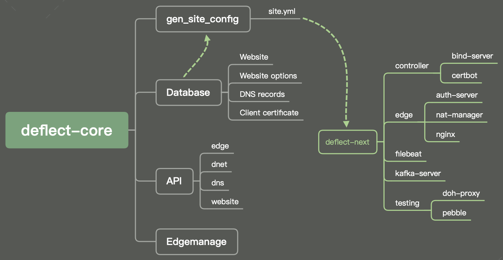

# Deflect Core

This project serves as the core of Deflect, several componenet is integrated within this project including edgemanage, database for storing DNS and website record, API and gen_site_config module.

## Overview

- Deflect-core is based on Django framework
- Uses MySQL as database to store:
  - website list
  - website options and config
  - DNS records
- gen_site_config script (django command line script) generates site.yml according to database
- Provides an HTTP API to interact with database
- Provides an Web interface to interact with database (django admin)
- Works with two submodules:
  - edgemanage3
  - deflect-next
- edgemanage3:
  - python integration
  - feature:
    - edge_query: query edge status
    - edge_conf: configure edge
- deflect-next
  - python integration
  - triggers when there is an change in the database
  - input
    - config.yml (with edge information from edgemanage3, controller and banjax_next configs)
    - site.yml (generated with gen_site_config)
  - features
    - push new site.yml to deflect-next network
    - provision new deflect-next edge
    - provision new deflect-next controller

## Provisioning and Deployment

### System requirements

1. Python 3.6.10
2. Django 3.1
3. Django REST framework 3.11.1
4. MySQL 5.7 or above (JSON support)

### Deployment

Deflect core could be installed in a python virtual env

    python -m venv venv
    source venv/bin/activate

Two git submodule, including `edgemanage` and `deflect-next` should be init and install

    git submodule update --init
    cd edgemanage3 && python setup.py install
    cd deflect_next/orchestration && pip install -r requirements.txt

After that, we could setup deflect-core, edit `.env` and setup database

    pip install -r requirements.txt
    cp core/.env.example core/.env
    python manage.py migrate
    python manage.py createsuperuser --email admin@example.com --username admin

Start the dev server with

    python manage.py runserver

### Celery (dev)

Run a celery worker with RabbitMQ for development

    python manage.py migrate django_celery_results  # first time
    rabbitmq-server
    celery -A core worker -l info

or change broker settings in `settings.py`

    CELERY_BROKER_URL = 'amqp://localhost'

### Edgemanage

After executing `python setup.py install` for edgemanage, there will be 3 binary installed

- edge_manage
- edge_query
- edge_conf

Directly executing these command should work as usual, but **an edgemanage config yaml is required** before running such command

1. `cp dev/edgemanage/edgemanage.example.yaml dev/edgemanage/edgemanage.yaml`
2. Edit `edgemanage.yaml`, replace `<abs_path>` with absolute path of this project directory (without trailing `/`)
3. Create `dev/edgemanage/edges/dev` and insert edges hostname, line by line

Execute commands to ensure edgemanage is installed correctly

    edge_manage --dnet dev --config dev/edgemanage/edgemanage.yaml -v
    edge_conf --dnet dev --config dev/edgemanage/edgemanage.yaml --mode unavailable --comment "out" {edge_hostname}
    edge_query --dnet dev --config dev/edgemanage/edgemanage.yaml -v

## django-admin commands

### deflect_next

This command calls `deflect-next` function to perform edge related operation from the command line.

    python manage.py deflect_next --sites <path-to-site-yml> --output <path-to-dir> --config <path-to-config-yml> --key <ssh_private_key>

A [config.yml](dev/deflect_next/input/config.sample.yml) is required for this command. It defines the IP, domain name of the remote machine which your edge should be provisioned.

Copy the sample config to `config.yml` and replace the default `example.com` and `0.0.0.0` into valid domain and IP. A real domain with the following DNS settings is also required:

    ns1.next.example.com.	3600	IN	A	0.0.0.0
    ns2.next.example.com.	3600	IN	A	0.0.0.0
    next.example.com.	3600	IN	NS	ns1.next.example.com.

For dev purpose, the output dir could be set to `dev/deflect_next/output`, `site.yml` could be generated by `gen_site_config` command.

A SSH private key is required to connect to the remote host (defined in `config.yml` with key name `docker_host_ip`)

### gen_site_config

Generate `site.yml` file according to `Website`, `WebsiteOption` and `Record` model

    python manage.py gen_site_config --output <path> --blacklist <list.txt> --debug

Configuration should be set in `.env` before running this command:

    GSC_LOG_FILE=/var/tmp/gen_site_config.log
    GSC_OUTPUT_LOCATION=/var/www/brainsconfig
    GSC_PARTITIONS={"part1": {"dnets": ["dnet1"]}, "part2": {"dnets": ["dnet2"]}}
    GSC_DEFAULT_NETWORK=dnet1
    GSC_IGNORE_APPROVAL=True

`GSC_IGNORE_APPROVAL` ignores `approval` in `website_option` during `gen_site_config`, this should be set to `True` in most cases.

For dev purposes, `GSC_LOG_FILE` and `GSC_OUTPUT_LOCATION` could make use of the `dev/gen_sit_config` directory.

### deep_diff

This command executes `deepdiff` on two givne YAML file, and generates a difference in YAML format.

    python manage.py deep_diff --file1 <path> --file2 <path> --output <path>

`tests/test_gen_site_config.py` make use of this command to ensure generate `site.yml` is identical to `tests/sample/site.yml`.

## Tests

Invoke django test. Test includes API, Model and gen_site_config test, this will read your local `.env` file. For CircleCI tests, please refer to config in `.circleci`, test coverage report is also generated with automate test.

    python manage.py test

## Django Admin

Built-in admin interface can be accessed via [http://localhost:8000/admin](http://localhost:8000/admin)

## REST framework GUI

REST framework provides built-in GUI for API testing, auth is required by clicking "Log in" on the top right corner when accessed via [http://localhost:8000/api](http://localhost:8000/api)

## API Documentation

Please refer to [HTTP API Documentation](https://equalitie.github.io/deflect-core/)
