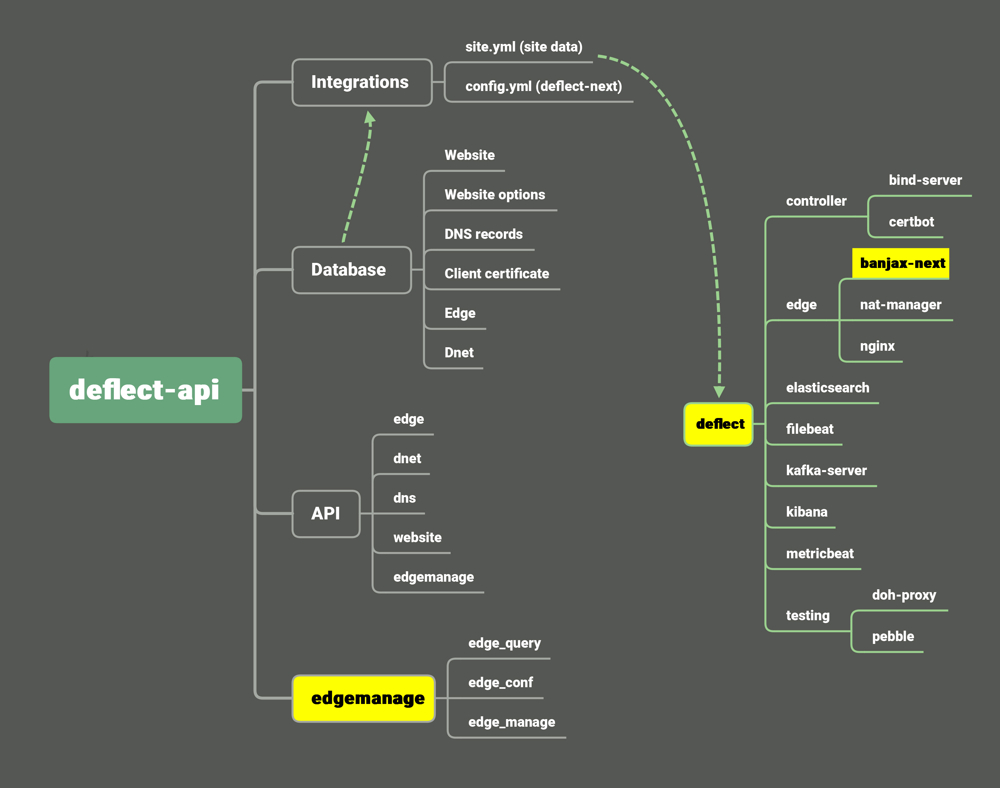

# Deflect Core

This project serves as the core of Deflect, several componenet is integrated within this project including edgemanage, database for storing DNS and website record, API and gen_site_config module.

## System diagram

## Overview

- Deflect-core is based on Django framework
- Uses MySQL as database to store:
  - Website list (URL, origin IP)
  - Website options and config
  - DNS records
  - Client certs
  - Edge (IP, hostname, dnet)
  - Dnet
- gen_site_config script (django command line script) generates site.yml according to database
- Provides an HTTP API to interact with database
- Provides an Web interface to interact with database (django admin)
- Works with two submodules (highlighted in the diagram above)
  - edgemanage3
  - deflect-next
- edgemanage3:
  - python integration
  - feature:
    - edge_query: query edge status
    - edge_conf: configure edge
    - edge_manage: cronjob to execute every min
- deflect-next
  - python integration
  - triggers when there is an change in the database
  - input
    - config.yml (according to DB, get a list of edge IP)
    - site.yml (generated with gen_site_config)
  - features
    - push new site.yml to deflect-next network
    - provision new deflect-next edge
    - provision new deflect-next controller

## Integration

Deflect-core has several integration mechanism in place, this table is a breif overview of how everything work together:

verb    | subject       | 1st reaction         | 2nd reaction
--------| --------------|----------------------|-------------------------
CD[1]   | website[3]    | `gen_site_config`    | `deflect_next(mode=full)`
U[2]    | website       | `gen_site_config`    | `deflect_next(mode=edge)`
CU      | edge          | edgemanage update[4] | `deflect_next(mode=full)`
D       | edge          | edgemanage update    | `docker prune`
C       | dnet          | edgemanage update    |
D       | dnet          | edgemanage update    |

In this table, subject could represent HTTP API endpoint, or operation via django admin. Once the action of the verb, for example, C (create), was committed, the 1st reaction will be trigger right away. Depending on the category, the second reaction will be triggered after the first reaction was complete.

Most long running task are triggered by celery worker, such as `gen_site_config` and `deflect_next`.

Footnotes:

1. CD: Create(C) and Delete(D)
2. U: Update(U)
3. website: Websites, Website Options, DNS records and certificates
4. edgemanage update: files under `edgelist_dir` is updated according to latest database changes of dnet and edges

## Provisioning and Deployment

Please refer Please refer to [INSTALL.md](docs/INSTALL.md)

## Usage

### API Documentation

Please refer to [HTTP API Documentation](https://equalitie.github.io/deflect-core/)

### Django command line

#### **deflect_next**

This command calls `deflect-next` function to perform edge related operation from the command line.

    python manage.py deflect_next --sites <path-to-site-yml> -sys <path-to-system-yml> --config <path-to-config-yml> --key <ssh_private_key> --mode <edge|full>

[config.yml](dev/deflect_next/input/config.sample.yml) and [system.yml](dev/deflect_next/input/system.sample.yml) is required for this command. `config.yml` defines the IP, domain name of the remote machine which your edge should be provisioned. `system.yml` defines the required system sites. Please follow the `TODO` mark in both sample file to complete your setup.

Copy the sample config to `config.yml` and replace the default `example.com` and `0.0.0.0` into valid domain and IP. A real domain with the following DNS settings is also required:

    ns1.next.example.com.	3600	IN	A	0.0.0.0
    ns2.next.example.com.	3600	IN	A	0.0.0.0
    next.example.com.	3600	IN	NS	ns1.next.example.com.

For dev purpose, the `output_prefix` in `config.yml` could be set to `dev/deflect_next/output`, `site.yml` could be generated by `gen_site_config` command.

A SSH private key is required to connect to the remote host (edges and controller)

Please be aware of the `--mode` option, which could be either `edge` or `full`.

- edge mode: Only connect to all edges in the database to execute `install_nginx_config` and `install_banjax_next_config`. Typically for updating `site.yml`
- full mode: Connects to both edges and controller to do a full install

#### **gen_site_config**

Generate `site.yml` file according to `Website`, `WebsiteOption` and `Record` model

    python manage.py gen_site_config --output <path> --blacklist <list.txt> --debug

Configuration should be set in `.env` before running this command:

    GSC_LOG_FILE=/var/tmp/gen_site_config.log
    GSC_OUTPUT_LOCATION=/var/www/brainsconfig
    GSC_PARTITIONS={"part1": {"dnets": ["dnet1"]}, "part2": {"dnets": ["dnet2"]}}
    GSC_DEFAULT_NETWORK=dnet1
    GSC_IGNORE_APPROVAL=True

`GSC_IGNORE_APPROVAL` ignores `approval` in `website_option` during `gen_site_config`, this should be set to `True` in most cases.

For dev purposes, `GSC_LOG_FILE` and `GSC_OUTPUT_LOCATION` could make use of the `dev/gen_sit_config` directory.

### Tests

Invoke django test. Test includes API, Model and gen_site_config test, this will read your local `.env` file. For CircleCI tests, please refer to config in `.circleci`, test coverage report is also generated with automate test.

    python manage.py test

### Django Admin

Built-in admin interface can be accessed via [http://localhost:8000/admin](http://localhost:8000/admin)

### REST framework GUI

REST framework provides built-in GUI for API testing, auth is required by clicking "Log in" on the top right corner when accessed via [http://localhost:8000/api](http://localhost:8000/api)
